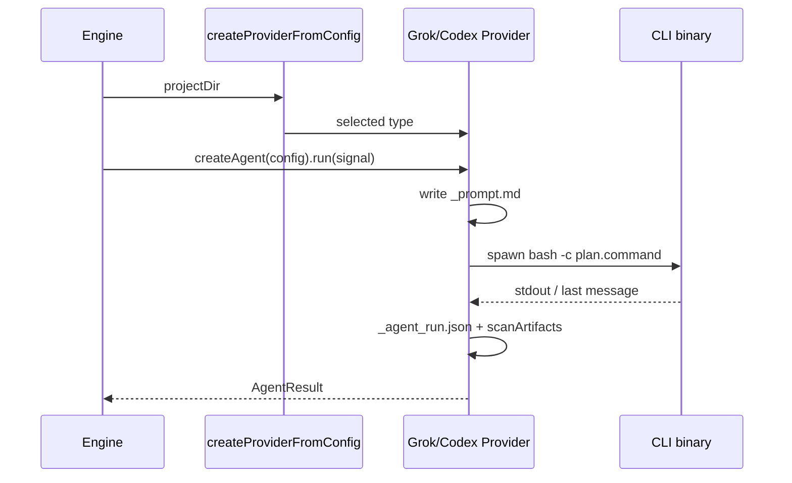

# 【providers】支持 codex 与 grok 两个 AgentProvider，默认 grok

- Issue: #40
- 状态: Approved
- 最后更新: 2026-07-18

## 1. 背景

`ProviderConfig.type` 已预留 `codex` 但无实现；`grok` 未进类型面。工厂仅在 `claude_code > milkie > pi` 间选择。本机连通探针确认：

- **grok** `-p` / `--prompt-file` 非交互可用（两次成功）
- **codex** `exec` 在 CLI ≥0.144.5 可用（0.143 对默认模型失败）

需要 CLI 型 AgentProvider 接入，与既有 Claude Code 模式一致。

## 2. 名词解释

| 术语 | 含义 |
|------|------|
| CLI provider | 通过 spawn 本地 agent CLI 完成角色任务的 `AgentProvider` |
| selectProviderType | 多 type 并存时的确定性选择函数 |

## 3. 设计目标与非目标

- **目标**
  - `type: "grok"` / `type: "codex"` 可配置并映射到实现
  - 优先级：**grok > codex > claude_code > milkie > pi**；空配置默认 **grok**
  - 对齐 Claude Code：prompt 组装 → spawn CLI → artifact 扫描；timeout/abort 用 `killProcessTree`
- **非目标**：删除现有 provider；TUI 全能力；engine/web 大改；SDK 直连

## 4. 能力与功能设计

开发者在 `petri.yaml` 声明 provider type 后，`createProviderFromConfig` 返回对应实现；`createAgent` → `run` 驱动 CLI 并在 `artifactDir` 留下产物。

### 4.1 UI / UX

N/A（无页面变更）

## 5. 设计思路与折衷

| 候选 | 决定 | 理由 |
|------|------|------|
| 默认仍 pi | 否 | 与「grok 为默认」冲突 |
| 多 type 时 grok 优先 | **是** | 显式 type 单选不被覆盖；并存时确定性优先 |
| 内嵌 SDK | 否 | 与 design.md Codex=CLI 一致 |

**CLI flags（冻结自探针）**

- Grok：`--prompt-file` + `--always-approve` + `--output-format plain` + `--cwd`
- Codex：`exec --skip-git-repo-check -C -o --dangerously-bypass-approvals-and-sandbox`，prompt 经 stdin

可测性：`buildGrokArgs` / `buildCodexArgs` / `selectProviderType` 纯函数；run 路径用 fake binary。

## 6. 架构设计

### 6.1 逻辑分层

```
petri.yaml → loadPetriConfig → selectProviderType
  → GrokProvider | CodexProvider | ClaudeCode | Milkie | Pi
createAgent → spawnCliCommand (detached + killProcessTree)
  → _agent_run.json / _result.md / scanArtifacts → AgentResult
```

### 6.2 核心业务流程



## 7. 模块设计

| 模块 | 职责 |
|------|------|
| `src/types.ts` | `ProviderType` 含 `grok` |
| `src/util/provider.ts` | `selectProviderType` + 工厂 |
| `src/providers/grok.ts` | Grok CLI provider |
| `src/providers/codex.ts` | Codex CLI provider |
| `src/providers/cli-runner.ts` | 共享 spawn/scan/find binary |

## 8. API / CLI 设计

配置：

```yaml
providers:
  default:
    type: grok   # or codex | claude_code | milkie | pi
```

环境变量：`PETRI_GROK_BIN`、`PETRI_CODEX_BIN`（可选二进制覆盖）。

无新 petri 子命令。

## 9. 边界考虑

- CLI 缺失：spawn error → `_error.txt`
- 超时/abort：timer + signal + forceSettle + `killProcessTree`
- codex 旧 CLI/鉴权：记录真实失败，不伪造成功
- 默认优先级变更：仅当声明 grok 或空 providers 时影响路由

## 10. 迁移 / 兼容 / 回滚

- 既有仅 `claude_code` / `milkie` / `pi` 配置行为不变
- 空 `providers`：由隐式 pi 路径改为 **grok**（breaking for empty configs）
- 回滚：还原工厂优先级与删除新 provider 文件

## 11. 测试计划

- **E2E**：本机连通探针（grok / codex≥0.144.5 成功）
- **Integration**：fake CLI 驱动真实 `GrokProvider`/`CodexProvider.run`
- **Unit**：`selectProviderType`、`build*Args`、工厂 type 映射
- 对应 Stories S1–S4

## 12. 开放问题 / 决策记录

- 决策：空 providers 默认 grok（2026-07-18）
- 决策：codex 自动化带 `--dangerously-bypass-approvals-and-sandbox`（对齐 claude skip-permissions）

## 13. 关联

- Issue: https://github.com/xforce-io/petri/issues/40
- Design comment: https://github.com/xforce-io/petri/issues/40#issuecomment-5008640124
- 模块：`src/providers/grok.ts`、`src/providers/codex.ts`、`src/util/provider.ts`
