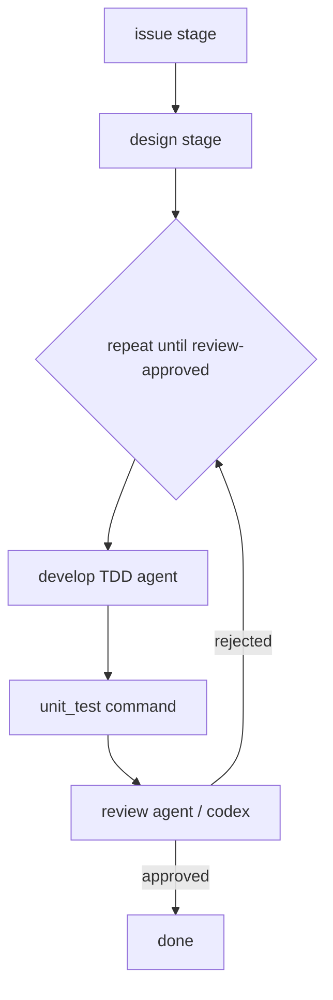

# 【code-dev】对齐 issue→设计→TDD→测试→codex review→迭代

> 历史说明：本文中「整 run 单 Provider」的限制已由 [#47](https://github.com/xforce-io/petri/issues/47) 解除；当前以角色 `role.yaml.provider` 选择命名 Provider。

- Issue: #42
- 状态: Approved
- 最后更新: 2026-07-18

## 1. 背景

目标开发流：

```
issue → 设计 → TDD 开发 → 测试 → codex review → 迭代修复
```

当前内置模板 `src/templates/code-dev` 为：

```
design → repeat(develop → review) until review-approved
```

本设计冻结差距，并给出最小配置 diff 使模板语义对齐目标流（不改引擎多 Provider 能力）。

## 2. 名词解释

| 术语 | 含义 |
|------|------|
| CLI provider | 整 run 共用一个 `AgentProvider`（工厂选择） |
| command stage | 确定性 shell 阶段，可带 gate，不走 agent |
| strong gate | 如 `review-approved`，适合 `repeat.until` |

## 3. 设计目标与非目标

- **目标**：对照六段可核验；pipeline 形状覆盖 issue 落盘、design 门禁、TDD develop、独立测试 command stage、review 门禁、develop↔test↔review 迭代；codex 在单 Provider 约束下可配置；stub+真 Engine 跑通 done。
- **非目标**：同 run 多 Provider 按角色分流；真实 GitHub issue 付费 E2E；删除既有 provider。

## 4. 差距对照（目标 vs 现状 vs 调整后）

| 目标阶段 | 现状 code-dev | 判定 | 原因 | 调整后 |
|----------|---------------|------|------|--------|
| **1. Issue** | 无独立 stage；仅 `engine.run(input)` 字符串 | **缺失** | 无 issue 角色/产物落盘，需求不进 artifact 索引 | 新增 `issue` stage + `issue_analyst` 角色，gate `issue-accepted`，产物 `issue.md` / `issue.json` |
| **2. 设计** | 有 `design` stage + `design-complete` gate + design playbook（含 test plan） | **符合** | 结构完整 | 保持；playbook 要求读 issue 产物 |
| **3. TDD 开发** | developer playbook 写「Write tests first」；gate `tests-pass` 为 agent 自报 `result.json` | **部分符合** | TDD 仅在 playbook 软约束；门禁靠 agent 自写 JSON，非真实测试运行器 | 保留 TDD playbook + `tests-pass` 自检门禁；强调读 design/issue |
| **4. 测试** | 无独立确定性 test stage；与 develop 混在一起 | **缺失** | 无 `command` stage；无法在 pipeline 拓扑上保证「测完再 review」 | 在 repeat 内 `develop` 后插入 `unit_test` **command stage**，gate `unit-tests-pass` |
| **5. Codex review** | 有 `code_reviewer` + `review-approved`；provider 为整项目 `claude_code` | **部分符合** | 有 review 角色与门禁，但 **未绑定 codex**；全 run 单 Provider | `petri.yaml` 声明 `type: codex`（整项目走 codex CLI，含 review）；文档标明引擎限制 |
| **6. 迭代修复** | `repeat` + `until: review-approved`，develop↔review | **符合** | 引擎已支持 until 与 stagnation | 扩展为 develop → unit_test → review 的循环 |

### 引擎级约束（不在本目标内消除）

- **整 run 仅一个 AgentProvider**：无法「develop=grok、review=codex」同 run 分流。  
  **接法**：本流程 demo/模板用 `type: codex` 时，design/develop/review **全部**经 codex CLI；若只要 review 用 codex，需另开「review-only 项目」或后续 per-role provider（记为后续增强）。

## 5. 设计思路与折衷

| 候选 | 决定 | 理由 |
|------|------|------|
| A. 只改文档不改模板 | 否 | 无法用 Engine 拓扑验证 |
| B. 最小 YAML/角色 diff 对齐形状 | **是** | 满足验收，不改引擎 |
| C. 引擎 per-role provider | 否（本目标） | 超出 non-goals |

**对齐后拓扑：**

```yaml
stages:
  - issue          # issue_analyst → issue-accepted
  - design         # designer → design-complete
  - repeat develop-review-cycle until review-approved:
      - develop    # developer → tests-pass (TDD 自检)
      - unit_test  # command → unit-tests-pass (确定性)
      - review     # code_reviewer → review-approved
```

**codex 接法：** `petri.yaml` → `providers.default.type: codex`。单 Provider 下 review 与其它角色同源 CLI。

**unit_test 命令：** 模板在 developer artifact 中优先执行 `npm test`，其次执行 `python -m pytest`，并且仅在命令成功后写出 `tests_passed` 证据。没有可识别 runner 时 fail-closed；其它技术栈必须显式替换 `unit_test.command`。

## 6. 架构（核心流程）



## 7. 模块设计

| 路径 | 变更 |
|------|------|
| `src/templates/code-dev/pipeline.yaml` | issue + unit_test command + repeat 内三阶 |
| `src/templates/code-dev/petri.yaml` | `type: codex` + 注释 |
| `src/templates/code-dev/roles/issue_analyst/**` | 新角色 |
| developer/designer playbooks | 链上 issue 产物 |
| `tests/integration.test.ts` + 新拓扑测试 | stub Engine + 真 loader |

## 8. API / CLI 设计

N/A（无新 CLI；配置面见上）

## 9. 边界考虑

- command stage 失败/gate 失败：block 或在 until 未满足时进入下一轮（与引擎现逻辑一致）
- 无 package.json 时 unit_test 命令仍须写出可判定 evidence（模板命令自洽）
- 空 providers 默认 grok 不适用于本模板（显式 codex）

## 10. 迁移 / 兼容 / 回滚

- 使用 code-dev 模板的新项目获得新拓扑；旧 example（如 fizzbuzz 线性三阶）不变
- 回滚：还原 `src/templates/code-dev/**` 与相关测试

## 11. 测试计划

- **E2E（stub）**：真 loader + stub agent + 真 command stage → `status=done`
- **Integration**：拓扑静态断言（issue/design/repeat/command/until）
- **Unit**：既有 command/repeat 引擎用例仍绿

## 12. 开放问题 / 决策记录

- 决策：本目标不实现 per-role provider；codex 接法 = 整项目 `type: codex`
- 决策：确定性测试用 command stage gate id `unit-tests-pass`，与 agent `tests-pass` 区分

## 13. 关联

- Issue: https://github.com/xforce-io/petri/issues/42
- Template: `src/templates/code-dev/`
