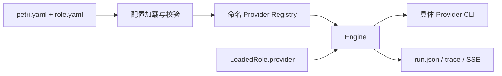
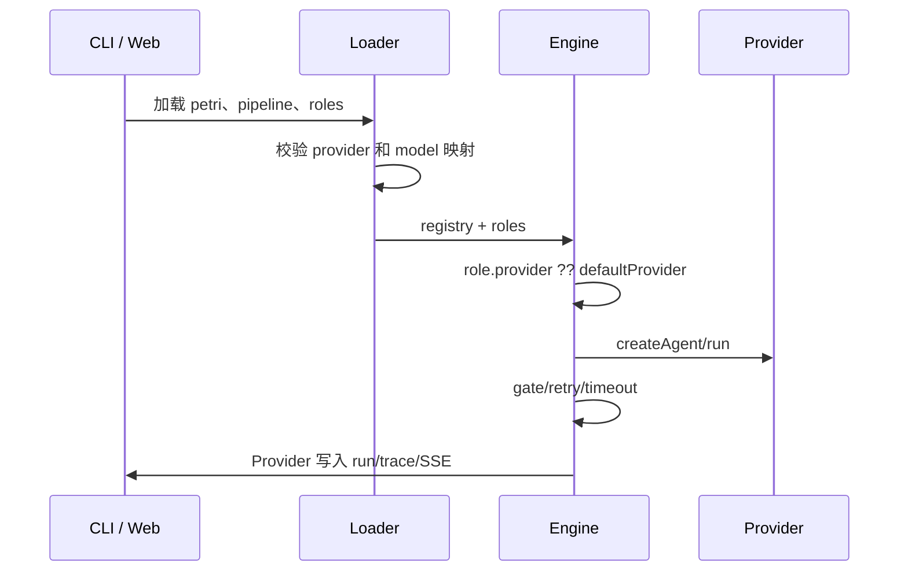

# 【engine】支持按 role 选择 Agent Provider

- Issue: #47
- 状态: Approved
- 最后更新: 2026-07-18

## 1. 背景

Petri 已有多个 CLI-backed Agent Provider，但 `createProviderFromConfig` 过去只会选择一个实例，Engine 的全部 role 共用它。这样 code-dev 的设计、开发和审查无法按职责选择不同 Agent。该能力会触及 role 配置、启动入口、运行引擎和可观测记录，需保持现有单 Provider 项目的行为。

## 2. 名词解释

- **命名 Provider**：`petri.yaml.providers` 下的键，例如 `coding` 或 `review`。
- **角色路由**：Engine 在每次 role 执行时，按该 role 的配置选择一个命名 Provider。

## 3. 设计目标与非目标

- **目标**：role 可选引用命名 Provider；未引用时保持项目默认；错误在执行前可读地失败；每次执行的 Provider 可在 run 记录、trace 和 SSE 中识别。
- **非目标**：一个 role 内多 Agent 投票/并行；Provider 凭证管理；Web 中编辑 Provider 配置；改变任一 Provider CLI 的权限策略。

## 4. 能力与功能设计

模板作者可在 `roles/<role>/role.yaml` 增加可选的 `provider`，其值必须是 `petri.yaml.providers` 的键；`model` 继续选择 `petri.yaml.models` 的键。未写 `provider` 时使用默认模型所绑定的命名 Provider，无法解析时沿用既有类型优先级。

### 4.1 UI / UX

Web Run 列表、详情、Trace 与实时日志显示 Provider 和模型。配置错误由 `petri validate` 或启动 run 返回包含 role 名的错误；不新增 Provider 编辑界面。

## 5. 设计思路与折衷

采用「Provider 名引用」而不是在 role 中直接写 `type: codex`。前者复用项目的 Provider 注册表，能与模型映射、凭证和未来 Provider 选项一致，也避免 role 侧重复配置。Engine 接受 Provider registry，同时保留旧的单 `provider` 构造形式以兼容现有调用和测试。

模型和显式 role Provider 若都映射到已声明的命名 Provider，必须一致；不一致即报错。stage override 仍只覆盖模型，不能改变 Provider，避免阶段配置隐式改写角色路由。

## 6. 架构设计

### 6.1 逻辑分层

### 6.2 核心业务流程

## 7. 模块设计

`src/util/provider.ts` 创建命名 registry、解析默认 Provider 并验证角色引用；`src/config/loader.ts` 把 role 的可选 `provider` 加入 `LoadedRole`；CLI 和 Web runner 在启动 Engine 前验证并构造 registry；Engine 每个 role 执行时解析实例；logger/API/UI 透传 Provider 字段。

## 8. API / CLI 设计

配置入口：`role.yaml.provider?: string`。成功形态为按角色执行并在结构化记录中出现 `provider`；失败形态为 `role "<name>": provider "<value>" is not declared...` 或模型归属不一致。旧的 `role.yaml` 不需要改动，`petri validate` 增加同样的路由校验。

## 9. 边界考虑

空 `providers` 仍默认 Grok。显式不存在的 Provider 绝不回退。命名模型只在其 `provider` 同时是已声明 Provider 时做一致性约束，保留 Milkie 等外部模型后端映射。命令 stage 不经 Agent 路由。重试、超时和 gate 仍由 Engine 的既有 stage 机制统一管理。

## 10. 迁移 / 兼容 / 回滚

`provider` 是 role 配置的可选字段，旧项目会继续使用旧默认选择逻辑。回滚只需移除 role 的 `provider` 与对应命名 Provider；历史 run 没有 Provider 字段时仍可被读取。

## 11. 测试计划

- **E2E（S1/S2）**：通过 Web runner 启动真实 Engine，并用假 Codex/Grok CLI 执行 developer/reviewer；断言两个 artifact、`run.json` Provider 字段和完成状态。
- **Integration（S2）**：Engine registry 测试两个 role 路由、记录 Provider；既有 Engine 测试覆盖 retry、timeout、gate 和 artifact 行为。
- **Unit（S1/S3）**：配置加载 `provider`、默认解析、registry 创建、未知 Provider 与模型/Provider 不一致错误。

## 12. 开放问题 / 决策记录

- 决策：Provider 由 role 决定，stage override 仅覆盖模型。
- 决策：code-dev 保持单 Codex 默认，README 提供混合 Provider 示例，不要求模板用户本地安装两个 CLI。

## 13. 关联

- Issue: #47
- PR: #48
- 相关模块：`src/util/provider.ts`、`src/engine/engine.ts`、`src/config/loader.ts`、`src/web/runner.ts`
