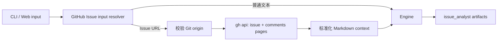
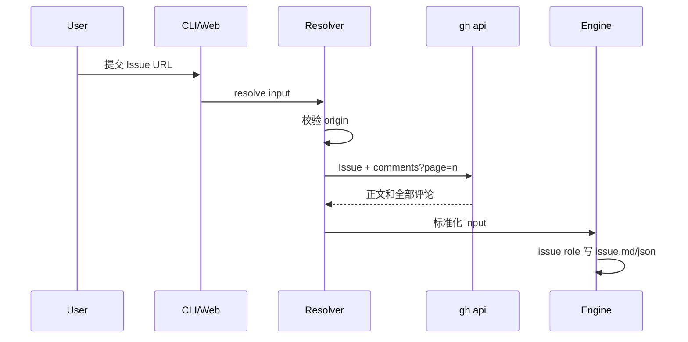

# 【code-dev】从 GitHub Issue URL 加载需求上下文

- Issue: #49
- 状态: Approved
- 最后更新: 2026-07-18

## 1. 背景

code-dev 的 issue 角色原先只把 pipeline input 当作普通文本。GitHub Issue URL 因而无法自动提供正文、标签、状态及讨论评论，设计和开发阶段可能遗漏已达成的结论。当前仓库是 GitHub 托管，且本地已有 `gh` 登录态可复用。

## 2. 名词解释

- **Issue URL**：`https://github.com/<owner>/<repo>/issues/<number>`，可带 query 或 hash。
- **展开输入**：将 GitHub Issue 元数据、正文和分页评论格式化后的 Engine input。

## 3. 设计目标与非目标

- **目标**：从当前 origin 的 GitHub Issue URL 拉取正文与全部评论；普通文本兼容；失败在 run 前可诊断；上下文可追溯到 run 与 issue artifact。
- **非目标**：创建/评论远端 Issue；GitLab/Jira 支持；递归下载评论链接；在 Engine 中耦合 GitHub。

## 4. 能力与功能设计

CLI `petri run --input <issue-url>` 与 Web Run 输入都识别 Issue URL。成功时，issue analyst 收到标准化上下文，必须将来源和相关评论结论保留在 `issue.md` / `issue.json`。普通文本不调用 GitHub。

### 4.1 UI / UX

Web 发起 run 时自动展开合法 URL，响应的 `inputSource` 为 `github_issue`。格式错误、跨仓库、无权限、404 或评论读取失败时，Web 返回 400 与 URL/原因；不新增配置页面。

## 5. 设计思路与折衷

以共享输入解析器完成 GitHub 逻辑，而不是放入 Engine。CLI 和 Web 在构造 Engine 前调用解析器，Engine 仍只接收字符串，因此其它 pipeline 和普通文本行为不变。解析器通过 `gh api` 使用既有登录态，避免新增 token、HTTP 客户端依赖或私有仓库认证分支。

评论按每页 100 条顺序请求至最后一页。相比 `gh api --paginate`，手动分页让响应边界、错误信息和测试替身更清晰。代价是一次 run 可能有多次 `gh` 调用，但输入规模与 Issue 评论量线性对应。

## 6. 架构设计

### 6.1 逻辑分层

### 6.2 核心业务流程

## 7. 模块设计

`src/input/github-issue.ts` 负责 URL/remote 解析、`gh api` 调用、分页与格式化。`src/cli/run.ts` 和 `src/web/routes/api.ts` 在启动前调用它。`issue_analyst` playbook 规定来源和讨论结论的 artifact 内容。Engine 与 Provider 不依赖 GitHub。

## 8. API / CLI 设计

入口不新增 CLI 参数，复用 `--input` 和 Web input 字段。Issue URL 成功时返回/记录展开文本；失败示例：`Failed to load GitHub Issue <url>: HTTP 403...`。仅当前 origin 的 GitHub Issue URL 被识别，其他普通文本保持原样。

## 9. 边界考虑

URL 允许 query/hash；PR、Discussion、GitLab URL 不会被误解析为 Issue。GitHub origin 不一致立即失败。缺少 `gh`、未认证、无权限、404、网络错误、无效 JSON 与任一评论页失败都会中止启动。评论内容仅进入既有本地 run 输入和 artifacts，遵循现有本地权限边界。

## 10. 迁移 / 兼容 / 回滚

没有配置迁移。非 URL 输入与旧版本一致。回滚只需停止调用解析器；历史 run 保留展开后的 input 文本，仍可读取。

## 11. 测试计划

- **E2E（S1）**：真实 Web HTTP API 配合临时 Git remote 与假 `gh`，验证 URL 自动展开到 run；真实 Engine + 假 Grok 验证正文与评论进入 issue artifact。
- **Integration（S2）**：普通文本解析不调用 git/gh，保留原文本。
- **Unit（S1/S3）**：URL/current origin、两页评论、403、跨仓库与无效 URL。

## 12. 开放问题 / 决策记录

- 决策：当前只支持 GitHub，因当前 origin 已识别为 GitHub 且可复用 `gh` 登录态。
- 决策：跨仓库 Issue 不支持，避免需求上下文与执行仓库不一致。

## 13. 关联

- Issue: #49
- PR: #50
- 相关模块：`src/input/github-issue.ts`、`src/cli/run.ts`、`src/web/routes/api.ts`、`src/templates/code-dev/roles/issue_analyst/`
