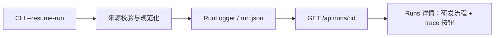
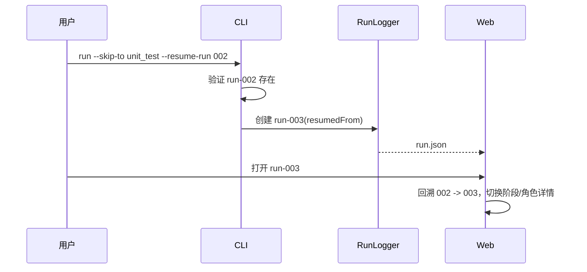

# 【web-runs】连贯查看流程与断点恢复链路

- Issue: #51
- 状态: Approved
- 最后更新: 2026-07-18

## 1. 背景

code-dev 的一次研发过程可能因测试或评审而分成多次 run。此前 `--skip-to` 虽能复用前序 artifacts，却没有记录来源 run；Runs 页也将 trace 节点渲染成不可操作的 `div`，用户无法从阶段、角色或续跑记录看清实际研发过程。Issue #164 的 Alfred 执行正暴露了这个断点：原始研发、测试和评审分散在不同 run 中。

## 2. 名词解释

- **恢复来源**：用户显式指定的、提供既有 artifacts 的 run。
- **研发流程链路**：从最初 run 到当前 run 的有序 `resumedFrom` 关系。

## 3. 设计目标与非目标

- **目标**：持久记录显式恢复来源；CLI 可校验来源；Web 可切换链路中的任一 run，并用鼠标或键盘查看 trace 的阶段与角色详情。
- **非目标**：不推断历史 run 的隐式父子关系；不改变 artifacts 复用策略；不增加跨项目全局 run 索引。

## 4. 能力与功能设计

`petri run --skip-to <stage> --resume-run <run-id>` 只在来源存在时启动，并将来源 run 与目标阶段写入新 run。Web 详情 API 返回从最早来源到当前 run 的有序链路；详情页以可点击 run 节点和可操作 trace 呈现流程。

### 4.1 UI / UX

Runs 详情在面包屑下方展示「研发流程」：每个 run 显示状态，当前项有选中态，点击可切换详情。trace 的阶段 attempt 与 role 都是原生按钮，鼠标、Enter 和 Space 均可选中，右侧 I/O、日志、Artifacts、Gate 随所选角色/阶段刷新。repeat 只是结构标签，不伪装为可点击节点；无 `resumedFrom` 的旧 run 不展示链路条。

## 5. 设计思路与折衷

选择在 `RunLogger` 中保存最小的 `{ runId, stage }`，而不是从 artifacts、时间或 `--skip-to` 痕迹猜测父 run。显式来源使结果稳定、可审计，代价是用户续跑时多传一个参数。Web API 在读取时沿该指针回溯，不新增索引文件，链路长度通常很短；用循环检测防止手工编辑 run.json 造成死循环。

## 6. 架构设计

### 6.1 逻辑分层

### 6.2 核心业务流程

## 7. 模块设计

- `src/engine/logger.ts`：定义并持久化 `resumedFrom`。
- `src/cli/run.ts`：规范化和校验 `--resume-run`，将其传给 logger。
- `src/web/routes/api.ts`：构造无环、最早到当前的 lineage。
- `src/web/public/*`：渲染和操作链路、trace 阶段与角色。

## 8. API / CLI 设计

- CLI：新增 `--resume-run <run-id>`；必须配合 `--skip-to`，接受 `001` 或 `run-001`；来源缺失时在启动前失败。
- API：`GET /api/runs/:id` 新增 `lineage` 数组，每项含 run 标识、状态、启动时间和可选 `resumedFrom`；保留原响应字段，兼容既有客户端。

## 9. 边界考虑

来源 run 不存在、run ID 非法、未给 `--skip-to` 都不创建新 run。历史 run 没有 `resumedFrom` 时 API 仅返回自身。重复/损坏的来源引用会被访问集合截断。UI 没有 stage 时保留全量日志，artifact 路径仍遵循既有 run 范围。

## 10. 迁移 / 兼容 / 回滚

无需迁移旧 run.json；新字段是可选字段。回滚后旧 run 仍能读取，只是不再写出或展示新的链路信息。CLI 既有 `--skip-to` 行为不变，显式来源仅增强可追溯性。

## 11. 测试计划

- **E2E（S1/S2/S3）**：以 Alfred #164 的既有 run 为来源执行 `--skip-to unit_test --resume-run 002`，启动 Web 服务，用浏览器点击流程链路、stage 与 role，确认右侧详情切换且可见原始研发→测试→评审过程。
- **Integration（S1/S2）**：临时项目创建来源与续跑 run，调用 `GET /api/runs/:id`，断言链路顺序和 `resumedFrom`。
- **Unit（S1/S2/S3）**：logger 写入字段；CLI 规范化、缺少 `--skip-to` 与来源缺失报错；静态 a11y 断言 trace 为原生按钮、提供 pressed 状态与 lineage 渲染。

## 12. 开放问题 / 决策记录

- 决策：不为旧数据推断链路，避免把共享 artifacts 或同时运行误判为恢复关系。
- 决策：Web 只负责查看与跳转，本期不在 Web 新建运行表单中添加恢复来源选择器。

## 13. 关联

- Issue: #51
- 相关实现：`src/engine/logger.ts`、`src/cli/run.ts`、`src/web/routes/api.ts`、`src/web/public/`
- 验证样本：Alfred Issue #164
