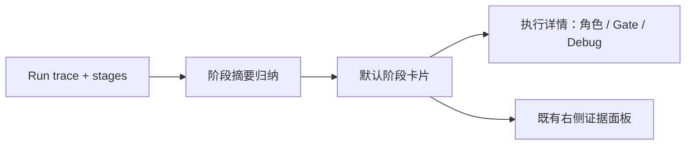
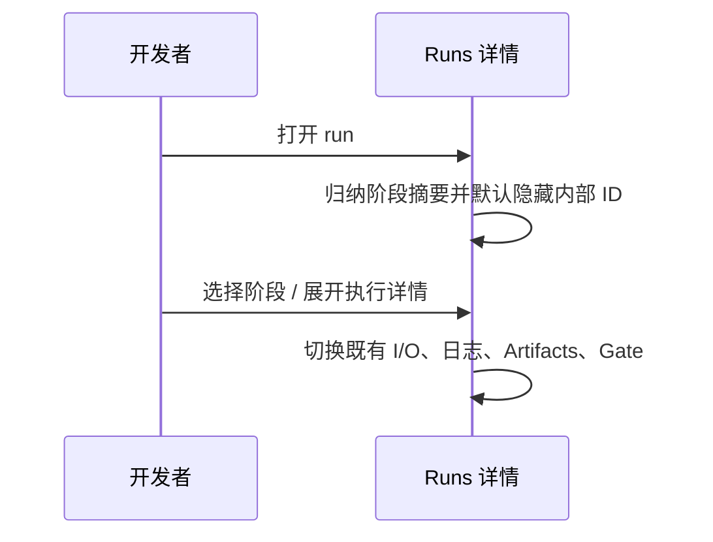

# 【web-runs】重构研发流程工作台的信息层级与可读性

- Issue: #52
- 状态: Approved
- 最后更新: 2026-07-18

## 1. 背景

#51 让 run lineage 和 trace 节点可操作，但真实 code-dev 详情仍将运行时 trace 直接暴露给用户。内部 ID、provider/model 与重复 gate 文案挤占空间，导致 Alfred #164 的流程无法快速扫描。

## 2. 名词解释

- **阶段工作台**：以业务阶段为默认阅读单位的 Runs 详情左栏。
- **执行详情**：角色、gate 与调试元数据的按需展开层。

## 3. 设计目标与非目标

- **目标**：首屏显示阶段顺序、状态、耗时、失败摘要和恢复边界；详细证据按需展开；状态语义一致。
- **非目标**：不改变 RunLogger、trace schema、artifact 路径或执行语义；不增加跨项目总览。

## 4. 能力与功能设计

默认卡片对应一个 stage attempt，展示人类可读名称、轮次、耗时和状态。失败时仅显示可行动摘要；用户可展开角色与 gate，右侧仍使用既有 I/O、Log、Artifacts、Gate 证据面板。

### 4.1 UI / UX

顶部 lineage 表达来源与续跑。左栏卡片默认不显示 `att:`、`role:`、provider/model 或完整 shell 命令；`执行详情` 使用原生按钮并有 `aria-expanded`，调试 ID 位于原生 `details` 内。repeat 只作为轮次文本，不单独竞争成功/失败颜色。

## 5. 设计思路与折衷

在前端由既有 `trace` 与 `stages` 归纳阶段摘要，而非扩展 API 或引擎。这样保留 #51 的精确角色选择，且避免视觉需求污染运行数据。代价是需要一次额外的 UI 归纳逻辑；数据量小且只在详情渲染时执行。

## 6. 架构设计

### 6.1 逻辑分层

### 6.2 核心业务流程

## 7. 模块设计

`src/web/public/app.js` 负责摘要归纳、阶段选择和展开；`style.css` 定义卡片与状态语义；`index.html` 保留现有详情布局。后端 API 无改动。

## 8. API / CLI 设计

N/A。本需求只重构已存在 Runs 响应的展示层。

## 9. 边界考虑

没有 trace 或角色时回退既有 stage 列表/等待态。失败原因超过摘要长度或为 command failure 时压缩为行动提示，完整内容仍在 Gate/Log。键盘用户可聚焦阶段卡片、展开按钮和角色按钮。

## 10. 迁移 / 兼容 / 回滚

无需数据迁移。旧 run 只要包含 stages/trace 即可展示；回滚仅恢复前端渲染和样式。

## 11. 测试计划

- **E2E（S1/S2/S3）**：重启 Alfred #164 的 Web 服务，用 Computer Use 打开 run-002，验证四个阶段摘要、Test 失败摘要和展开详情；打开 run-004 验证续跑链路与通过的 Review。
- **Integration**：现有 Web API trace 测试继续覆盖 repeat、gate 与 run detail 数据。
- **Unit（S1/S2/S3）**：静态前端测试覆盖阶段摘要入口、人类化 label、失败摘要、展开控制与无障碍属性。

## 12. 开放问题 / 决策记录

- 决策：默认仅显示阶段，不自动展开角色，优先保证流程扫描。
- 决策：Debug metadata 使用原生 `details`，为排障保留 trace ID 而不污染默认视图。

## 13. 关联

- Issue: #52
- 前置能力：#51
- 相关模块：`src/web/public/app.js`、`src/web/public/style.css`、`src/web/public/index.html`
