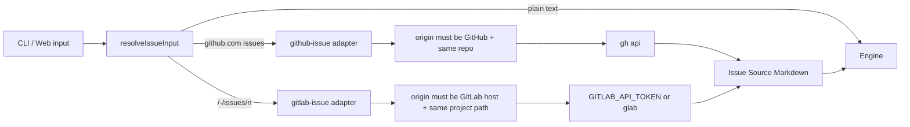
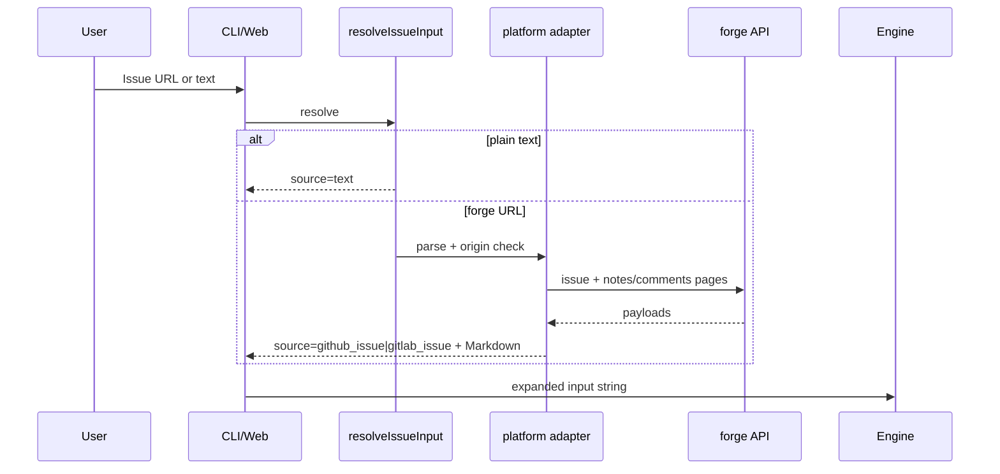

# 【code-dev】GitLab Issue URL 输入适配（单 pipeline + 双 adapter）

- Issue: #61
- 状态: Approved
- 最后更新: 2026-07-20

## 1. 背景

#49 已支持从当前 origin 的 GitHub Issue URL 展开正文与评论。GitLab（含自建 host）仓库贴 `/-/issues/<n>` 时不会被识别，或无法拉取讨论上下文。code-dev 主链路与 forge 无关，差异仅在输入适配层。本设计按「一条 code-dev + 多 forge adapter」补齐 GitLab，不拆第二套模板。

## 2. 名词解释

| 术语 | 含义 |
|------|------|
| Issue URL | 可识别的远端 Issue 链接（GitHub 或 GitLab） |
| Adapter | 按平台解析 URL、校验 origin、拉取正文/评论并格式化的纯逻辑模块 |
| Issue Source | 展开后的统一 Markdown 上下文，供 issue_analyst 使用 |

## 3. 设计目标与非目标

- **目标**：当前 origin 的 GitLab Issue URL（含自建 host 的 `/-/issues/<n>`）在 CLI/Web 启动前展开 title/body/分页评论；失败可诊断；普通文本与 GitHub 路径不回归；仍为一条 code-dev pipeline。
- **非目标**：创建/评论远端 Issue；开 PR/MR；CI 门禁；Jira；第二套 code-dev 模板/拓扑；Engine 内耦合 forge；真实云账号在线 E2E（允许注入 API 替身）。

## 4. 能力与功能设计

- CLI `petri run --input <gitlab-issue-url>` 与 Web Run 输入识别 GitLab Issue URL。
- 成功时 `inputSource` 为 `gitlab_issue`；GitHub 仍为 `github_issue`；普通文本保持原 `source`。
- 失败（跨仓库、非 GitLab origin、鉴权/404/评论失败、无效 URL）在启动前 400/exit 1，不静默当文本。

### 4.1 UI / UX

N/A（不新增配置页；Web 复用现有 Run 输入与错误 JSON）。

## 5. 设计思路与折衷

| 候选 | 决定 | 理由 |
|------|------|------|
| A. 第二套 `code-dev-gitlab` 模板 | 否 | 拓扑相同，分叉维护成本高 |
| B. 单 pipeline + 统一 `resolveIssueInput` + GitHub/GitLab adapter | **是** | 与 #49 分层一致，Engine 仍只收字符串 |
| C. 仅文档说明手动粘贴正文 | 否 | 无法验收 URL 路径 |

**凭证**：默认 `GITLAB_API_TOKEN`（`PRIVATE-TOKEN`）调 `https://<host>/api/v4/...`；无 token 时回退 `glab api`（若已登录）。可注入 `runApi`/`getOrigin` 便于单测不触网。

**URL 最低支持**：`https://<host>/<project-path>/-/issues/<n>`（project-path 可含多级 group）。不要求覆盖全部历史/替代路径形态。

**格式**：统一 `# Issue Source` + `Platform: github|gitlab`；playbook 中性化读取（兼容旧 `# GitHub Issue Source` 历史 run）。

## 6. 架构设计

### 6.1 逻辑分层

### 6.2 核心业务流程

## 7. 模块设计

| 模块 | 职责 |
|------|------|
| `src/input/issue-input.ts` | 统一入口：识别平台、分发、导出结果类型 |
| `src/input/github-issue.ts` | GitHub adapter（保留既有可测 deps） |
| `src/input/gitlab-issue.ts` | GitLab adapter：URL/remote 解析、分页 notes、格式化 |
| CLI `run.ts` / Web `api.ts` | Engine 前调用统一入口；映射 `inputSource` |
| `issue_analyst` playbook | 按 Issue Source 保留 URL/讨论 |

## 8. API / CLI 设计

- 入口参数不变：`--input` / Web `input`。
- 成功：`inputSource`: `github_issue` \| `gitlab_issue` \| 既有文本来源字段。
- 失败示例：`Failed to load GitLab Issue <url>: HTTP 403...`；跨 origin：`does not belong to current origin`。
- 兼容：非 URL 文本行为与 #49 前一致；GitHub 路径不因 GitLab 改动而改变成功语义。

## 9. 边界考虑

- 仅当前 origin 同 host + 同 project path 的 Issue；跨项目立即失败。
- origin 非 GitLab 却贴 GitLab URL → 失败（不退化为文本）。
- 评论分页 `per_page=100` 至末页；系统 notes（`system: true`）过滤，只保留讨论评论。
- Token 不落盘、不写入 artifact 明文配置；错误信息避免回显完整 token。
- 自建 host：以 origin URL 的 host 为准，不硬编码 `gitlab.com`。

## 10. 迁移 / 兼容 / 回滚

- 无配置迁移。新格式 `# Issue Source`；playbook 同时识别旧 `# GitHub Issue Source`。
- 回滚：入口改回仅 `resolveGitHubIssueInput`；历史 run 保留展开后的 input 文本。

## 11. 测试计划

- **E2E（S1）**：Web/CLI 路径 + 注入假 API/origin：GitLab URL 展开后进入 run input；Engine + 假 provider 时 issue 产物可见 body/评论（或等价 structural + unit 驱动真实解析入口）。
- **Integration（S2/S3）**：跨 origin / 403 / 非 GitLab origin 启动前失败；纯文本不调 API；GitHub 成功路径 `source=github_issue` 回归。
- **Unit（S1/S2）**：URL/remote 解析（含嵌套 group、自建 host）、两页 notes、过滤 system notes、无效 URL。

对应验收：**S1** 展开成功；**S2** 失败可诊断；**S3** 文本与 GitHub 不回归、无平行模板。

## 12. 开放问题 / 决策记录

- 决策：不拆第二套 code-dev；仅 adapter 分流。
- 决策：凭证优先 `GITLAB_API_TOKEN`，回退 `glab`（与仓库 Agents 凭证约定一致）。
- 决策：最低 URL 形态 `/-/issues/<n>`；历史无 `/-/` 路径不作为必须项。

## 13. 关联

- Issue: #61
- Related: #49, `docs/design/49-issue-url-context.md`
- PR: （合并请求创建后回填）
- 模块：`src/input/*`、`src/cli/run.ts`、`src/web/routes/api.ts`、`src/templates/code-dev/roles/issue_analyst/`
