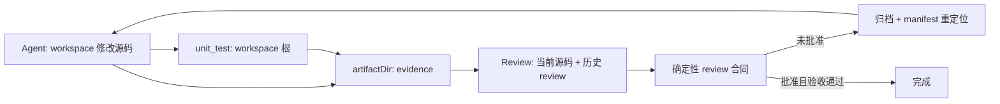

# 【code-dev】工作区执行与可收敛质量回路

- Issue: #65
- 状态: Approved
- 最后更新: 2026-07-21

## 1. 背景

code-dev 当前将 agent 的工作目录、源码目录和测试目录都隐式设为 stage artifact 目录。这样 deterministic unit_test 可以只验证 agent 自行创建的隔离项目，不能证明仓库默认入口已通过。与此同时，失败 review 的 artifact 被归档后，后续循环的 manifest 仍可能列出原路径，导致 developer/reviewer 无法稳定回归上轮 findings。

## 2. 名词解释

| 术语 | 含义 |
|---|---|
| workspace | agent 修改源码和 command stage 执行命令的绝对项目目录；worktree 模式下为临时工作树 |
| artifactDir | 每个 role/stage 写 evidence、gate JSON 与模型输出的目录，不承载项目源码 |
| lineage | artifact 从当前路径到失败 attempt 归档路径的可读历史 |

## 3. 设计目标与非目标

- **目标**：workspace 和 artifactDir 语义分离；默认测试验证 workspace；失败 review 在后续轮次可读；review 对验收和历史 finding 形成可检查的契约。
- **非目标**：保证任意复杂任务自动合入；为业务域硬编码 DoD；以 JSON schema 判断 finding 的事实正确性。

## 4. 能力与功能设计

- agent context 同时暴露 workspace 与 artifactDir，并要求源码只写 workspace。
- code-dev 的 unit_test 默认在 workspace 根探测并执行项目测试；项目继续通过 pipeline command 覆盖命令。
- review 产物包含稳定 finding id、历史 finding 的处理状态和验收清单状态；approved 需要验收完整通过，但真实 CRITICAL/HIGH 仍可否决。

### 4.1 UI / UX

N/A（CLI/Web 入口不新增页面；行为和 evidence 语义改变）。

## 5. 设计思路与折衷

选择给 Engine/AgentConfig 增加显式 workspace，而不是复制 artifact 中的源码到项目根。前者使 provider、command stage 与用户复现命令共享同一工作树，后者会增加同步、覆盖和清理语义。

失败 artifact 仍归档而非保留原文件；ArtifactManifest 在归档时重定位路径，既保留 attempt 边界，又只向后续 agent 暴露可读文件。

review 合同只验证结构和状态关系：历史 finding 必须被引用、验收未通过不能 approved。它不替代 reviewer 对代码安全性和正确性的判断。

## 6. 架构设计

### 6.1 逻辑分层

### 6.2 核心业务流程

1. CLI/Web 为 Engine 提供实际 execution workspace。
2. Engine 将 workspace 传给 provider，并以其作为 command stage cwd。
3. review gate 失败时 Engine 归档 role evidence 并更新 manifest 的路径。
4. 下一轮 context 读取已归档 review；review playbook 按合同输出历史 finding 和验收状态。

## 7. 模块设计

| 模块 | 职责 |
|---|---|
| `src/cli/run.ts` / `src/web/runner.ts` | 计算并传递 workspace |
| `src/engine/*` | context、command cwd、artifact lineage |
| `src/providers/*` | 使用 workspace 运行 provider CLI，同时保留 artifact 输出位置 |
| `src/templates/code-dev/*` | 根测试、验收清单与 review 回归合同 |

## 8. API / CLI 设计

- 内部 `AgentConfig` 和 `Engine` 增加 `workspaceDir`；未显式传入时兼容使用当前进程 cwd。
- pipeline public schema 不增加新字段；既有 `unit_test.command` 覆盖方式保持不变。

## 9. 边界考虑

- workspace 必须为绝对可访问目录，worktree 模式使用临时工作树。
- 没有支持的测试入口时命令失败，不回退 artifactDir。
- 历史 review 无新合同字段时按无历史 finding 兼容；malformed 结果不能当作关闭。
- manifest 重定位只接受 artifact 根内的路径，禁止路径逃逸。

## 10. 迁移 / 兼容 / 回滚

- 新 Engine/AgentConfig 字段可选，旧调用默认 cwd。
- 旧 review.json 可读取；新模板在新 run 中写完整合同。
- 回滚仅移除 workspace 显式传递和模板合同；历史归档 evidence 保留。

## 11. 测试计划

- **E2E（S1）**：fixture Git repo + worktree，agent 在 workspace 修改源文件，根测试读取该文件并通过，artifactDir 不作为源码 cwd。
- **Integration（S2/S3）**：首轮失败 review 含两个 findings，归档路径进入后续 context；第二轮输出两条处理状态和验收状态。
- **Unit**：provider argv/cwd、command stage cwd、manifest 重定位、review 合同的缺 id/重复 id/遗漏历史 finding/未通过验收却 approved。
- **对应**：S1=P1-A，S2=P1-B，S3=P1-C，S4=模板文档。

## 12. 开放问题 / 决策记录

- 决策：验收清单是 approved 的必要条件而非充分条件。
- 决策：新 CRITICAL/HIGH finding 可以继续否决，但不能跳过旧 finding 回归。
- N/A（其余实现细节由测试约束）。

## 13. 关联

- Issue: #65
- Design proposal: https://github.com/xforce-io/petri/issues/65
- 模块：`src/engine/`、`src/providers/`、`src/templates/code-dev/`
