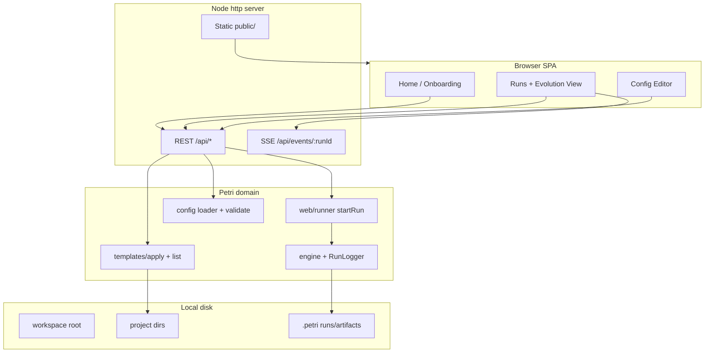
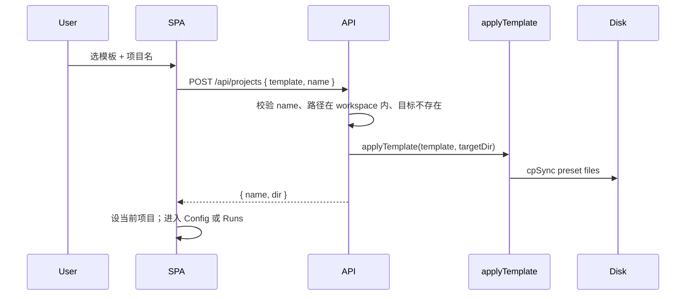
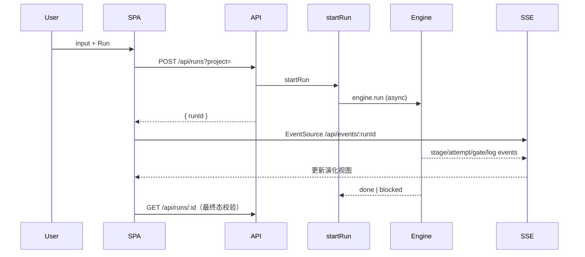
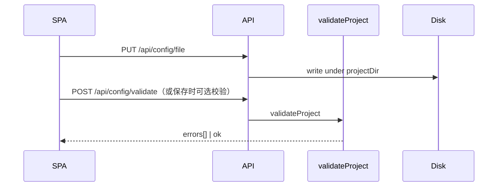

# 【web】产品级单用户 Web 体验

- Issue: #9
- 状态: Draft
- 最后更新: 2026-07-17
- 分支: `feat/9-product-web-ui`

## 1. 背景

Petri 已有本机 `petri web`（`src/web/`：Node `http` + 静态 SPA + SSE），具备 Dashboard / Runs / Config / Create 四 Tab，并能列出预置模板、发起 run、编辑配置。但默认心智仍是 CLI：无项目时 `petri web` 直接退出；首屏偏运维台；「用模板建项目 → 跑 → 看演化」未作为主路径产品化。

Issue #9 将 Web 升为**单用户本机产品主入口**。范围收敛：

- **做**：用预置模板初始化项目/流程、打开已有项目、执行 run、观察演化、微调实例配置。
- **不做**：流程模板本身的创建/编排/发布；NL Create 向导不作为本 issue 验收必选项；多用户/云托管。

## 2. 名词解释

| 术语 | 含义 |
|------|------|
| **预置模板 (preset template)** | 随 petri 分发的流程骨架（当前如 `src/templates/code-dev`），只读资产 |
| **项目 (project)** | 本机含 `petri.yaml` 的目录；运行配置与 `.petri/` 落盘于此 |
| **实例配置** | 某项目下的 `pipeline.yaml` / `roles/**` 等，可编辑；**不是**可复用模板资产 |
| **演化视图** | 单次 run 的 stage / attempt / gate / blocked|timeout 原因 / 日志 / artifacts 的可视化 |
| **工作区根 (workspace root)** | `petri web` 启动时的 cwd；用于发现/创建项目子目录 |

## 3. 设计目标与非目标

### 目标

1. **一条命令进产品**：`petri web` 总能打开浏览器可用的首屏（允许 0 个已有项目）。
2. **模板消费者路径**：选预置模板 → 指定目录名 → 落地项目 → 进入该项目上下文，≤5 步。
3. **执行与观察**：UI 内发起 run；实时看到 stage/attempt/gate；blocked/timeout 有可读原因；状态延迟目标 <2s。
4. **实例配置闭环**：查看/编辑/校验/保存项目内 YAML，并一键进入运行。
5. **空态/错态可恢复**：无项目、无 run、校验失败、blocked、服务不可达均有文案 + CTA（或可复制 CLI）。

### 非目标

- 模板作者工具、模板市场、模板版本发布。
- 多用户、鉴权、远程 SaaS、计费。
- 必选交付 NL `Create` 向导产品化（现有 Create Tab 可保留但不纳入 #9 验收）。
- 重写进化引擎语义；引入重型前端框架（本阶段默认不强制 React/Vue）。
- 移动端原生 App。

## 4. 能力与功能设计

### 4.1 用户主路径（E2E）

```text
启动 petri web
    → 首屏（价值一句话 + ≤3 CTA）
    → A) 从预置模板新建项目  或  B) 打开已发现项目
    → 项目上下文锁定（顶栏）
    → 填写 input → Run
    → 演化视图（实时）
    → （可选）改配置 → 再 Run
```

### 4.2 功能清单（对齐 Stories）

| Story | 能力 |
|-------|------|
| S1 | 产品首屏；冷启动可交互 <3s；主 CTA：用模板新建 / 打开项目 / 查看最近 run（有则显示） |
| S2 | 列出预置模板；选择模板 + 项目名/路径 → 服务端拷贝模板落地；列出 workspace 内已有项目并切换 |
| S3 | 发起 run；SSE/轮询更新；attempt 级时间线；gate 结果；blocked/timeout 原因；日志与 artifacts |
| S4 | 配置文件树 + 编辑器 + validate + 保存；保存后可 Run |
| S5 | 各空态/错态专用 UI + 下一步 |

### 4.3 UI / UX

**信息架构（建议四区，演进现有 Tab）**

```text
┌─────────────────────────────────────────────────────────┐
│  Petri  │  当前项目 ▾  │  Home │ Runs │ Config │  [help] │
└─────────────────────────────────────────────────────────┘
│  主内容区（按路由）                                      │
└─────────────────────────────────────────────────────────┘
```

- **Home（产品首屏 / 总览）**：无项目时 = onboarding；有项目时 = 统计 + 最近 runs + 快捷 Run。
- **Runs**：启动表单 + 历史 + **Run 详情（演化视图）**（可从现 Runs 详情强化，不必拆第五 Tab）。
- **Config**：实例配置编辑（现 Config 演进）。
- **Create Tab**：本 issue **不验收**；实现时可隐藏或降级为「高级 / 实验」入口，避免与「模板新建」混淆。

**关键状态**

| 状态 | UI |
|------|-----|
| 0 项目 | Home 引导：选模板新建；说明可把 web 开在含多项目的父目录 |
| 项目无 run | Runs 空态 + 表单 CTA |
| running | 时间线 running 节点脉冲；SSE 追加 log |
| blocked / timeout | 醒目失败条 + `reason` 全文 + 链到失败 stage/attempt |
| 校验失败 | 编辑器旁错误列表（文件 + 消息） |
| API 不可达 | 横幅 + 重启 `petri web` 的可复制命令 |

**演化视图最小信息架构**

- 纵向：**Stage → Attempt(s)**（每次 timeout/gate fail 为独立 attempt 节点，避免「静默空白」）。
- 节点字段：状态、耗时、gate pass/fail、失败摘要。
- 详情：Log / Artifacts / Gate /（若有）`_error.txt` / `_agent_run.json` 超时标记。

## 5. 设计思路与折衷

### 5.1 候选方案

| 方案 | 描述 | 结论 |
|------|------|------|
| **A. 演进现有 vanilla SPA + API** | 改 IA/空态、补「模板落地」API、强化 run 详情 | **采用** |
| B. 引入 React/Vite 重写前端 | 更好组件化与设计系统 | **本阶段不做**；成本高、与 #9 验收无强绑定；若后续痛点再开 issue |
| C. 仅文档/CLI 包装「伪产品」 | 不改 UI | **放弃**；不满足 S1–S5 |

### 5.2 关键折衷

1. **0 项目可启动**  
   现状：`webCommand` 无 `petri.yaml` 则 `exit(1)`。  
   改为：允许 `projects=[]`，server 仍起来；API 中依赖项目的接口返回 400 + 可读错误；Home 走 onboarding。  
   工作区根 = cwd，新建项目默认 `path.join(workspaceRoot, projectName)`。

2. **模板落地复用 init 逻辑，抽共享模块**  
   将 `cli/init.ts` 中的模板解析与 `cpSync` 抽到如 `src/templates/apply.ts`（名称可微调），CLI 与 `POST /api/projects` 共用。避免 Web/CLI 两套拷贝规则。

3. **演化数据：结构化优先，log 解析兜底**  
   现状 run 详情大量依赖 `run.log` 正则（`parseStagesFromLog`），attempt/timeout 边界易丢。  
   本 issue：**优先消费 `RunLogger` 已有/可扩展的结构化事件与 `summary`/status 文件**；SSE 推送 stage-attempt 事件；缺字段时再回退 log。不在本 issue 重做完整 trace 存储，但 API 契约要带上 `attempts[]` 与 `blockedReason`。

4. **Create / NL 生成**  
   保留后端路由以免破坏现网；前端默认不把 Create 作为主 CTA；#9 验收不依赖 generate。

5. **单用户安全模型**  
   本机绑定、无鉴权；所有写路径限制在 `workspaceRoot` 与已登记 `project.dir` 下（path traversal 防护保持/加强）。不监听 `0.0.0.0` 除非显式 flag（默认 `localhost`，与现行为一致则保持）。

6. **前端技术**  
   继续 `public/index.html|app.js|style.css`，用清晰分区与 CSS 达到「产品感」；不引入构建链，降低发布摩擦。

## 6. 架构设计

### 6.1 逻辑分层



依赖方向：`cli/web.ts` → `web/server.ts` → `routes/*` → `templates/*` | `runner` | `engine` | `config`。  
前端不直读写磁盘。

### 6.2 核心业务流程

#### 6.2.1 从模板新建项目



#### 6.2.2 执行与观察



#### 6.2.3 配置保存



## 7. 模块设计

| 模块 | 职责 | 输入/输出 |
|------|------|-----------|
| `cli/web.ts` | 解析 port、发现项目、**允许 0 项目**、打印 URL | cwd → `createPetriServer` |
| `web/server.ts` | 静态资源、路由、`workspaceRoot`、项目注册表（可运行时追加新建项目） | HTTP |
| `web/routes/api.ts` | REST：projects CRUD(最小)、templates、runs、config、validate | JSON |
| `web/routes/sse.ts` | 订阅 RunLogger 事件 | text/event-stream |
| `web/runner.ts` | 启动 Engine；不变语义 | StartRunOpts |
| `templates/list.ts` + `templates/apply.ts`（新） | 列举预置模板元数据；拷贝到目标目录 | templateId, targetDir |
| `web/public/*` | Home/Runs/Config IA 与空态 | 浏览器 |

**项目注册表**：server 内存维护 `projects: {name, dir}[]`；`POST /api/projects` 成功后 `push`；`GET /api/projects` 返回列表（可附 `dir` 展示名）。进程重启后仍靠启动时 discovery + 新建落在 workspace 内可被再次发现。

## 8. API / CLI 设计

### 8.1 CLI

```text
petri web [--port <n>]
```

- **成功**：打印 `http://localhost:<port>`；0 项目时附加 onboarding 提示（「在 UI 中用模板创建项目」）。
- **失败**：端口占用等 OS 错误；**不再**因「未找到 petri.yaml」退出。

可选后续（非必须）：`--open` 自动打开浏览器——若实现成本低可做，不阻塞验收。

### 8.2 REST（增量；均默认单用户本机）

| 方法 | 路径 | 语义 |
|------|------|------|
| GET | `/api/meta` | `{ workspaceRoot, version, product: "petri-web" }` 供首屏 |
| GET | `/api/projects` | `[{ name, dir? }]`；允许 `[]` |
| POST | `/api/projects` | body: `{ name: string, template: string }` → 在 workspace 下创建；**201** + 项目；冲突 **409**；非法名 **400** |
| GET | `/api/templates` | 预置模板列表：`[{ id, title, description? }]`（扩展现有 handler 的元数据） |
| POST | `/api/runs` | 现有；`?project=`；无当前项目 **400** |
| GET | `/api/runs`、`/api/runs/:id` | 现有；**强化** detail：`status`、`blockedReason`、`stages[].attempts[]`（能取则取） |
| GET/PUT | `/api/config/file` | 现有；路径限制在 projectDir |
| POST | `/api/config/validate` | 对**当前项目根**跑 `validateProject`（与 generate/validate 区分） |
| GET | `/api/events/:runId` | 现有 SSE |

**兼容**：现有 runs/config/generate 路由保持可用；前端主路径可不调用 generate。

**POST /api/projects 约束**

- `name`：`^[a-zA-Z0-9][a-zA-Z0-9_-]{0,63}$`（示例规则，实现时可微调但需文档化）。
- `template`：必须在预置列表中。
- 目标 `join(workspaceRoot, name)` 必须不存在且 canonicalize 后仍在 workspace 内。

### 8.3 成功/失败形态

统一 JSON：`{ error: string, code?: string }`；校验类可附 `details: [{ path, message }]`。

## 9. 边界考虑

| 主题 | 处理 |
|------|------|
| 输入 | 项目名/路径白名单；拒绝 `..`、绝对路径逃逸 |
| 空数据 | 0 模板（异常包）→ 错误页提示重装；0 项目 → onboarding |
| 并发 | 单用户；同项目多 run 沿用现有 lock（若 CLI lock 未接 web，本 issue **应**让 `startRun` 走与 CLI 一致的 lock，避免双跑互踩） |
| 权限 | 本机文件系统权限即权限；无 RBAC |
| 性能 | 静态资源与 API 本机；首屏 <3s；SSE 事件节流避免 UI 卡顿 |
| 安全 | path traversal；默认 localhost；不实现鉴权故不声称多用户安全 |
| 超时展示 | 消费 #6 后的 timeout/blocked reason 字符串，不在 UI 再实现杀进程 |
| 残余 | 已 setsid 孤儿进程仍可能存活（引擎侧限制），UI 只展示引擎给出的状态 |

## 10. 迁移 / 兼容 / 回滚

- **兼容**：已有项目目录、`.petri/runs`、旧 API 客户端（若有）继续可用。
- **行为变化**：`petri web` 在无项目时**不再非零退出**——属有意 breaking（更友好）；文档与 CHANGELOG 一句说明。
- **回滚**：回退本 issue 相关提交即可；磁盘上由模板创建的项目仍是普通文件树，无需迁移脚本。
- **配置**：无新强制 petri.yaml schema；可选 `web.port` 保持。

## 11. 测试计划

### E2E（用户可见路径）

| # | 步骤 | 可判定结果 | Story |
|---|------|------------|-------|
| E1 | 在空目录启动 `petri web` | 进程不退出；HTTP 200 首页；`GET /api/projects` = `[]` | S1/S5 |
| E2 | `POST /api/projects` 用 `code-dev` + 合法 name | 目录出现 `petri.yaml`+`pipeline.yaml`+`roles/`；`GET /api/projects` 含新项 | S2 |
| E3 | 选中项目，`POST /api/runs`（可用 stub provider 的集成测试） | 返回 runId；随后 detail status 为 done 或 blocked；UI/API 可见 stage 信息 | S3 |
| E4 | 改 pipeline 非法 YAML 保存或 validate | 返回明确错误；合法保存后 GET 一致 | S4 |
| E5 | 无项目时 POST runs | 400 + 可读 error；非空栈裸崩 | S5 |

实现形态：优先 **API 级集成测试**（vitest + 临时目录 + `createPetriServer`）；前端关键路径用轻量 DOM/合同测试或手动清单，不强制浏览器 E2E 框架（非目标引入 Playwright 除非已有）。

### Integration

- `applyTemplate` 与 CLI `init` 同源：同一模板落到 tmp 目录结构一致。
- SSE：启动假 run 推送事件，客户端可读（现有 sse 测试扩展）。
- startRun + lock：二次 run 冲突时错误可展示。

### Unit

- 项目名校验、路径规范化拒绝逃逸。
- 模板 id 未知 → 400。
- run detail 组装：blockedReason / attempts 字段映射。

## 12. 开放问题 / 决策记录

### 已拍板（对话）

- 产品方向 C，单用户本机。
- **支持**用模板建流程 + 执行 + 观察；**不做**模板本身创建。
- NL Create 非本 issue 必验。

### 建议默认（实现前可在 PR 微调，无需再阻塞设计）

| 项 | 默认 |
|----|------|
| 新建项目位置 | 仅 `workspaceRoot/name`，本阶段不做「任意绝对路径选取器」 |
| Create Tab | UI 隐藏或标「实验」，路由保留 |
| 是否自动 open 浏览器 | 可选，P2 |
| 前端框架 | 不引入 |

### 仍开放（不阻塞 Draft→实现）

- 预置模板元数据从何处读（目录扫描 vs 小 manifest.json）——实现时选扫描 + 可选 `template.yaml` description。
- attempt 级结构化事件是否扩展 RunLogger schema——若改动面大，第一期可用「log + summary 增强」达标，第二期再结构化。

## 13. 关联

- Issue: https://github.com/xforce-io/petri/issues/9
- 分支: `feat/9-product-web-ui`
- 现有：`src/web/**`、`src/cli/web.ts`、`src/cli/init.ts`、`src/templates/code-dev`
- 相关：#6 timeout 原因展示依赖引擎文案；旧 design `docs/superpowers/specs/2026-04-06-web-dashboard-design.md`（监控台视角，被本文件在产品层上位）

## Key Decisions

1. **演进 vanilla SPA，不重写框架** — 验收在路径与可理解性，不在技术栈换代。
2. **0 项目可启动 + POST 用模板建项目** — 打通产品主路径；模板 apply 与 CLI init 共享。
3. **Create/NL 非验收** — 控制范围，避免与模板消费者路径抢主 CTA。
4. **演化视图强化 attempt/blocked** — 对齐 Petri 差异化（进化环），而非只做通用 job 列表。
5. **写操作限制在 workspace/project 内** — 单用户本机安全底线。

## PR Plan

| PR | 标题 | 内容 | 依赖 |
|----|------|------|------|
| PR1 | `feat(templates): extract applyTemplate shared by CLI init` | `templates/apply` + `list`；`init` 改调共享；单测 | — |
| PR2 | `feat(web): allow zero projects; POST /api/projects from template` | web.ts / server 项目注册表；projects API；集成测 E1/E2 | PR1 |
| PR3 | `feat(web): product Home + project context chrome` | 首屏、顶栏项目切换、空态 S1/S2/S5 前端 | PR2 |
| PR4 | `feat(web): evolution view + run detail attempts/reasons` | API detail 增强、Runs 详情 UI、SSE 字段；测 S3 | PR2 |
| PR5 | `feat(web): config validate endpoint + editor empty/error states` | validate API、Config UX、S4/S5 | PR2 |
| PR6 | `docs: Web-first quickstart + link design` | README、issue promote | PR3–5 可平行收尾 |

每 PR 独立可测、可审；合并顺序 1→2→(3∥4∥5)→6。
